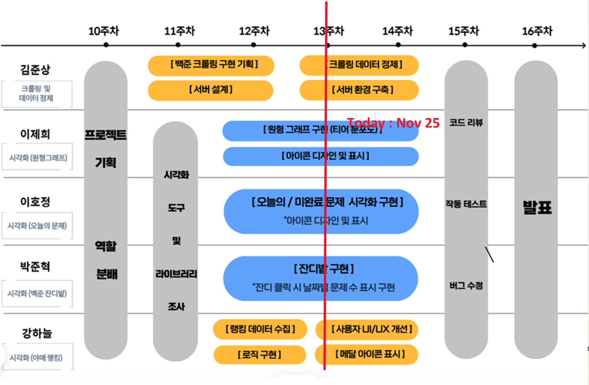
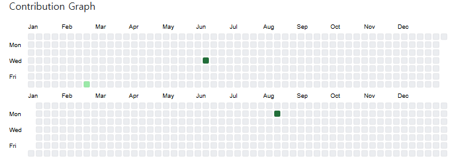
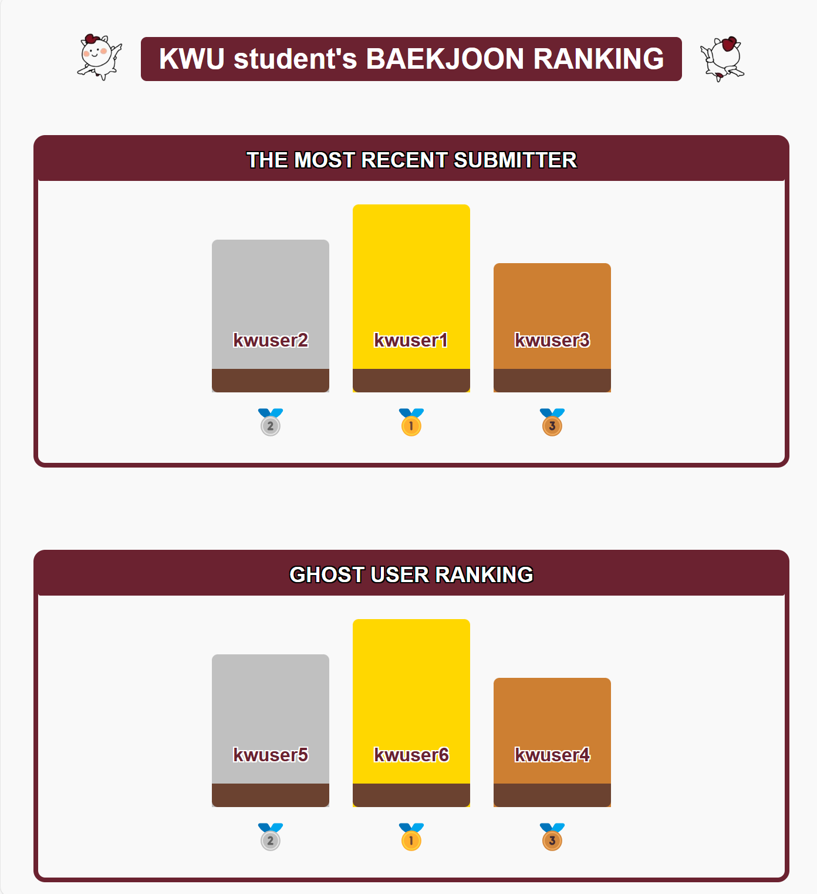
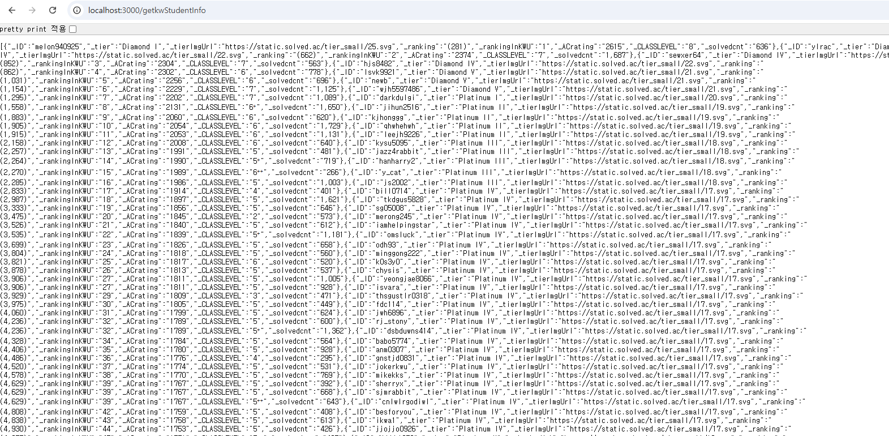

# Prograss Report for Team #6
## Progress Summary
- 백준에 있는 광운대학교 학생들의 정보, 광운대학교 순위, 광운대 학생들의 백준 제출 내역 크롤링 완료
- 임시 데이터로 잔디밭 그래프 구현 성공, 크롤링 데이터로 잔디밭 그래프 구성 진행중

## Project Schedule
<!-- 여기다가  빨간줄 그은 이미지 넣으면 됨-->

## Project Screenshot
### 박준혁
  
### 강하늘 
  
### 이제희
   
### 김준상

---
# Individual Progress Status
## 박준혁
임시 데이터로 잔디밭 그래프 생성 [(해당 커밋 보기)](https://github.com/sjml2002/oss_kwboj_6/commit/f88153c64e21ec6e016be71fc40844e30d571348) 
크롤링 데이터로 잔디밭 그래프 생성(진행 중) [(해당 커밋 보기)](https://github.com/sjml2002/oss_kwboj_6/commit/2066b1b6f6652d42cda5b6316676b616a78fd33e) 
## 강하늘
- Add images and update title with mascot design [(해당 커밋 보기)](https://github.com/sjml2002/oss_kwboj_6/commit/78b98c1add3c9226e22014d72fa188aa60d75b1b)  
- Change Ranking Design [(해당 커밋 보기)](https://github.com/sjml2002/oss_kwboj_6/commit/d85850c9f5f078140717682b2d37fab7f2b9864b)    
- Change Design [(해당 커밋 보기)](https://github.com/sjml2002/oss_kwboj_6/commit/7fe002701179663ff44faf8be9a26fcf6fe3ba95) 
## 이제희
- 광운대학교 학생들의 티어 분포도를 나타내는 pie-chart 기본 틀 작성 [(해당 커밋 보기)](https://github.com/sjml2002/oss_kwboj_6/commit/46ba06613cfe9d24db815b329cab61d261753d36) 
- 메인 페이지 디자인 (배너 등) & pie-chart에 데이터 삽입을 위한 js 함수 수정 및 기능 추가 [(해당 커밋 보기)](https://github.com/sjml2002/oss_kwboj_6/commit/362c205315553c4480432ac8ae78fc7fff4ee792) 
  - pie-chart 에는 학생들의 티어 분포를 나타낸다
  - pie-chart 오른쪽에 각 티어 학생수 표시
## 이호정

## 김준상
- 광운대학교 학생들의 정보를 크롤링 완료
[(해당 커밋 보기)](https://github.com/sjml2002/oss_kwboj_6/commit/9d1cf1e2503abe0a8d05e40ed1bb5a4f9973bf5e)
- 광운대학교 학생들의 백준 제출 내역에 대한 크롤링 작업 완료
[(해당 커밋 보기)](https://github.com/sjml2002/oss_kwboj_6/commit/093a1395ba73279da2a5e09b0271c2345a69950b)
- 백준 대학교 순위에 대한 크롤링 작업 완료
[(해당 커밋 보기)](https://github.com/sjml2002/oss_kwboj_6/commit/04d7a89139aded61bab9a7b40255a6b5aa700808)

