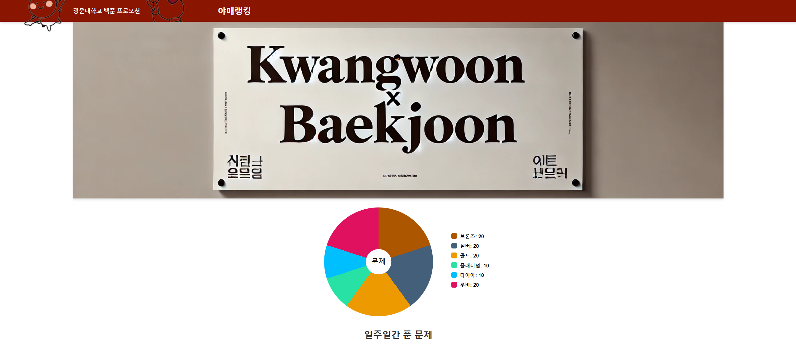

# Prograss Report for Team #6
## Progress Summary

## Project Schedule
<!-- 여기다가  빨간줄 그은 이미지 넣으면 됨-->

## Project Screenshot
### 강하늘 
  
### 이제희
   
# Individual Progress Status
## 박준혁

## 강하늘
- Add images and update title with mascot design [(해당 커밋 보기)](https://github.com/sjml2002/oss_kwboj_6/commit/78b98c1add3c9226e22014d72fa188aa60d75b1b)  
- Change Ranking Design [(해당 커밋 보기)](https://github.com/sjml2002/oss_kwboj_6/commit/d85850c9f5f078140717682b2d37fab7f2b9864b)    
- Change Design [(해당 커밋 보기)](https://github.com/sjml2002/oss_kwboj_6/commit/7fe002701179663ff44faf8be9a26fcf6fe3ba95) 
## 이제희
- 광운대학교 학생들의 티어 분포도를 나타내는 pie-chart 기본 틀 작성 [(해당 커밋 보기)](https://github.com/sjml2002/oss_kwboj_6/commit/46ba06613cfe9d24db815b329cab61d261753d36) 
- 메인 페이지 디자인 (배너 등) & pie-chart에 데이터 삽입을 위한 js 함수 수정 및 기능 추가 [(해당 커밋 보기)](https://github.com/sjml2002/oss_kwboj_6/commit/362c205315553c4480432ac8ae78fc7fff4ee792) 
  - pie-chart 에는 학생들의 티어 분포를 나타낸다
  - pie-chart 오른쪽에 각 티어 학생수 표시
## 이호정

## 김준상

